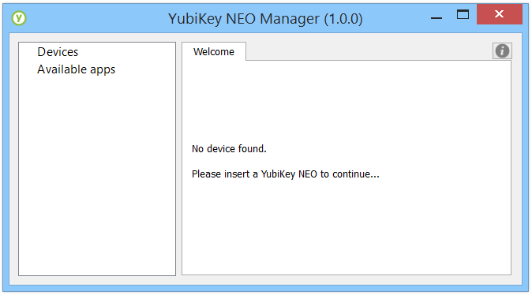
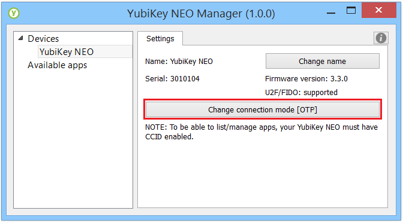

== YubiKey NEO Manager Manual

=== Using CCID on OSX and Linux
To be able to use any of the smartcard functionality of your YubiKey
NEO, you will need an up to date version of libccid (1.4.20 or later
is recommended). Often an older version will work, but will require
modification to detect the YubiKey in certain modes. To make this
modification easier, we provide a
link:https://github.com/Yubico/ifd-yubico/releases/download/ifd-yubico-1.0.0/ifd-yubico.pkg[packaged installer for OSX],
as well as a
link:https://github.com/Yubico/yubikey-neo-manager/blob/master/resources/linux-fix-ccid-udev[script for Linux].
Windows users do not need to take any action.

=== Change connection mode
In order to enable or disable modes on your YubiKey NEO or NEO-n, you
need to download the newest version of the Yubico NEO Manager. The NEO
Manager is available for Windows, OSX and Linux, and installers can be
downloaded from the Yubico website using the links below.

* NEO Manager for Windows: http://yubi.co/NEOMgrWin
* NEO Manager for OSX: http://yubi.co/NEOMgrMac
* NEO Manager for Linux: http://yubi.co/NEOMrgLux

Once downloaded, you will need to install the NEO Manager using the
default options. Once installed, launch the NEO Manager application to
proceed.

If a YubiKey NEO or NEO-n is not inserted in your PC, the NEO Manager
will prompt you to insert your YubiKey to continue. In order to change
settings with the NEO Manager, only one YubiKey NEO or NEO-n device can
be plugged into your computer.

image:image2.PNG[image]

To enable any desired combination of U2F, OTP and CCID modes, you will
need to click .

Clicking  will open up a window
allowing you to check boxes for OTP, CCID and U2F. Checking the boxes
will enable that functionality on the YubiKey NEO and NEO-n.

image:image7.PNG[image]

* The OTP mode refers to the YubiKey functions the NEO shares with the
standard YubiKey, including two Configuration Slots that can be
programmed with any two of the following: Yubico OTP (programmed by
Yubico in Slot 1, by default), OATH-HOTP, Challenge-Response and Static
Password.
* The CCID Mode refers to the smart card elements on the YubiKey NEO and
NEO-n, and includes the NEO applets such as OpenPGP, PIV and YubiOATH.

* The U2F Mode refers to the Universal 2^nd^ Factor (U2F) functionality
of the YubiKey NEO and NEO-n.

image:image8.PNG[image]

Once the desired modes are selected, click
 to confirm the selections. The NEO
Manager will instruct you to remove your YubiKey from the USB slot, then
plug it back in. This will allow the YubiKey to initialize all of the
selected modes.

image:image10.PNG[image]

Your YubiKey NEO or NEO-n will now work in the selected modes.

=== Renaming a YubiKey
The NEO Manager will allow you to optionally set a unique name for your
YubiKey NEO or NEO-n, in order to better identify it when you have
multiple YubiKeys. This can be done by clicking
image:image3.PNG[image] – doing so will open a new window
allowing you to change the name of the YubiKey NEO or NEO-n. Please note
that if you have NEO Manager installed on multiple computers, the name
change will only be reflected on the computer the change was made on.

image:image4.PNG[image]
